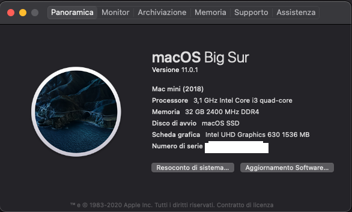

# Dell Optiplex 3060 MFF Hackintosh

EFI for Dell Optiplex 3060 MFF with OpenCore bootloader

### Computer Spec:

| Component        | Brank                              |
| ---------------- | ---------------------------------- |
| CPU              | Intel i3 8100T (4C-4T 6MB CFL)     |
| iGPU             | Intel® UHD Graphics 630            |
| Lan              | Realtek 8168                       |
| Audio            | Realtek ALC255                     |
| Ram              | 32 GB DDR4 2400 Mhz                |
| Wifi + Bluetooth | BCM943602BAED (DW1830)             |
| NVMe             | SAMSUNG 970 EVO PLUS 500 GB (MACOS)|
| SSD              | SAMSUNG 850 EVO 500 GB (WINDOWS)   |
| SmBios           | MacMini 8,1                        |
| BootLoader       | OpenCore                           |

## Peripherals

### What works and What doesn't or WIP:

- [x] Intel UHD 630 iGPU HDMI/DP Output
- [x] ALC255 Internal Speakers
- [x] ALC255 Native Combojack headphones
- [x] ALC255 Combojack microphone
- [x] ALC255 HDMI/DP Audio Output
- [x] ALC255 jack LINE-IN
- [x] All USB Ports 
- [x] SpeedStep / Sleep / Wake
- [x] HID Key PWRB & SLPB 
- [x] Wi-Fi and Bluetooth BCM943602BAED (DW1830) Module
- [x] CONTROLLER NVME PciE Gen3x4
- [x] CONTROLLER SATA III
- [x] Realtek RTL8168 LAN
- [x] NVRAM
- [x] Windows 10 boot from OpenCore

### Special Config:

- Usb port mapping performed
- Applied cosmetics pci-dev

### Post Install:

Open terminal and run install.sh from PostInsall/ComboJackAlc295. After reboot insert jack and appears this image

See [ioreg](./ioregmacbook.ioreg) for more clarification

## Credits

- [Apple](https://apple.com) for macOS;
- [Acidanthera](https://github.com/acidanthera) for OpenCore and all the lovely hackintosh work.
- [Dortania](https://dortania.github.io/OpenCore-Install-Guide/config-laptop.plist/icelake.html) For great and detailed guides.
- [Hackintoshlifeit](https://github.com/Hackintoshlifeit)

# If you need help please contact us on [Telegram](https://t.me/HackintoshLife_it) or [Web](https://www.hackintoshlife.it/)
