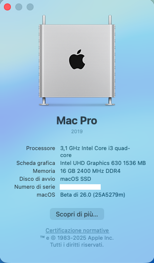

# Dell Optiplex 3060 MFF Hackintosh

EFI for Dell Optiplex 3060 MFF with OpenCore bootloader

### Computer Spec:

| Component        | Brank                              |
| ---------------- | ---------------------------------- |
| CPU              | Intel i3 8100T (4C-4T 6MB CFL)     |
| iGPU             | Intel® UHD Graphics 630            |
| Lan              | Realtek 8168                       |
| Audio            | Realtek ALC255                     |
| Ram              | 32 GB DDR4 2400 Mhz                |
| Wifi + Bluetooth | BCM943602BAED (DW1830)             |
| NVMe             | SAMSUNG 970 EVO PLUS 500 GB (MACOS)|
| SSD              | SAMSUNG 850 EVO 500 GB (WINDOWS)   |
| SmBios           | MacMini 8,1                        |
| BootLoader       | OpenCore 0.6.6                     |
| macOS            | Big Sur 11.3 (Beta)                |

## Peripherals & Bench

### What works and What doesn't or WIP:

- [x] Intel UHD 630 iGPU HDMI/DP Output
- [x] Intel UHD 630 iGPU - H264 & HEVC
- [x] ALC255 Internal Speakers
- [x] ALC255 Native Combojack headphones
- [x] ALC255 Combojack microphone
- [x] ALC255 HDMI/DP Audio Output
- [x] ALC255 jack LINE-IN
- [x] All USB Ports 
- [x] SpeedStep / Sleep / Wake
- [x] HID Key PWRB & SLPB 
- [x] Wi-Fi and Bluetooth BCM943602BAED (DW1830) Module
- [x] CONTROLLER NVME PciE Gen3x4
- [x] CONTROLLER SATA III
- [x] All Sensors (CPU, BATTERY, NVME, SATA, FAN)
- [x] Realtek RTL8168 LAN
- [x] Apple VTD
- [x] NVRAM
- [x] Windows 10 boot from OpenCore

### Special Config:

- Usb port mapping performed
- Applied cosmetics pci-dev

### Post Install:

Open terminal and run install.sh from PostInsall/ComboJackAlc255. After reboot insert jack and appears this image

See [ioreg](./ioregMacmini.ioreg) for more clarification

### MacOS bootable USB creation:
- Read the Dortania guide for creating your USB from Windows or macOS
- [Guide Dortania](https://dortania.github.io/OpenCore-Install-Guide/installer-guide/) - USB creation

## Bios settings
### Enable :
* SATA Operation : AHCI
* Fastboot : Thorough
* Integrated NIC : Enable

### Disable : 
* Secure Boot
* Absolute
* TPM2.0 Security On
* Intel SGX
* Enable UEFI Network Stack
* cfg lock and DVMT and unlock NVME gen3: DO AT YOUR OWN RISK!!! It may brick your laptop.

- [Bios Extract to txt](https://github.com/Lorys89/DELL_OPTIPLEX_3060_MFF/raw/main/TOOLS%20EFI%20MOD/bios%203%203060mff%20085C.txt)
 
Create a usb in FAT with MBR map and put [ru.efi](https://github.com/Lorys89/DELL_OPTIPLEX_3060_MFF/raw/main/TOOLS%20EFI%20MOD/RU.efi) in it 
then go to the bios, and create an entry with the path of the usb and setting the ru.efi file and the name of 
your choice startup and then send and finally click apply.

Restart and press f12 among the entries you will have the last created, click any key, then click alt + ì a menu will appear and
scroll to CpuSetup and click enter, in the new screen go with the arrows on the value 05BE and change it from 01 to 00 and click 
enter and then ctrl + w to save and then alt + q to exit. proceed to check if your CFG LOCK is unlocked.

For the DVMT pre all values you have to go to the Setup menu and enter and look for 08DC and set it from 01 to 02 (value 02 is for 64MB pre all)and then move then save with ctrl + w and to exit alt + q and you will have the suitable DVMT values to the igpu. 

For unlock the NVME from GEN2 to GEN3 you have to go to the Setup menu and enter and look the photo and set the value from 02 to 03 and then move then save with ctrl + w and to exit alt + q and you will have the NVME Work to GEN3. 

## Credits

- [Apple](https://apple.com) for macOS;
- [Acidanthera](https://github.com/acidanthera) for OpenCore and all the lovely hackintosh work.
- [Dortania](https://dortania.github.io/OpenCore-Install-Guide/config-laptop.plist/icelake.html) For great and detailed guides.
- [Hackintoshlifeit](https://github.com/Hackintoshlifeit) Support group for installation and post installation.

# If you need help please contact us on [Telegram](https://t.me/HackintoshLife_it) or [Web](https://www.hackintoshlife.it/)
